# Compte Rendu — TP1 : Premiers pas avec SLURM et PyTorch
**Cours :** CSC 8607 — Introduction au Deep Learning  
**Auteur :** Youssef DHOUIB

---

## Exercice 1 : Prise en main de SLURM

### 1. Modèle exact du GPU alloué
Le GPU qui m'a été attribué lors de la session interactive SLURM est un **NVIDIA L4**.

### 2. Commande d'annulation du job
Après avoir identifié le Job ID actif à l'aide de la commande `squeue -u $USER`, j'ai annulé l'exécution avec la commande :
```bash
scancel 1587
```

### 3. Fichier de log généré
Dans le dossier `logs/`, le fichier de sortie produit par le job SLURM s'intitule :
```text
hello-slurm-1592.out
```

### 4. Différence entre `ReqMem` et `MaxRSS`
Lorsqu'on analyse les métriques avec `sacct` :
* **`ReqMem` (Requested Memory) :** correspond à la quantité de mémoire vive demandée et réservée auprès de SLURM au moment de la soumission du job.
* **`MaxRSS` (Maximum Resident Set Size) :** représente la quantité maximale de mémoire vive physique réellement consommée par le processus durant toute sa durée d'exécution.

-> vérifier si les ressources demandées sont bien proportionnées par rapport au besoin réel de nos calculs.

---

## Exercice 2 : Création d'un environnement virtuel Python

### 1. Vérification de la version de Python et du chemin du binaire
Pour vérifier la version exacte de Python ainsi que l'exécutable utilisé dans  notre environnement virtuel actif (`deeplearning`), on utilise les commandes suivantes :

* **Version de Python :**
  ```bash
  python --version
  ```
  *Sortie :*
  ```text
  Python 3.10.20
  ```

* **Chemin vers le binaire :**
  ```bash
  which python
  ```
  *Sortie :*
  ```text
  /mnt/hdd/homes/ydhouib/miniforge3/envs/deeplearning/bin/python
  ```

### 2. Sortie du script `check_gpu.py`
> **Note :** Afin de détecter correctement les GPUs, on a exécuté la commande `pip install --upgrade torch`.

La vérification via le script Python `check_gpu.py` a produit la sortie suivante :
```text
PyTorch version: 2.14.0+cu130
CUDA available: True
Device count: 1
Device 0 name: NVIDIA L4
```

### 3. Vérification de la version de TensorBoard
Pour afficher la version de TensorBoard installée dans l'environnement :
```bash
tensorboard --version
```
*Sortie :*
```text
2.20.0
```

---

## Exercice 3 : Exercices théoriques (Papier & Markdown)

### Question 3.a : Architecture et Paramètres

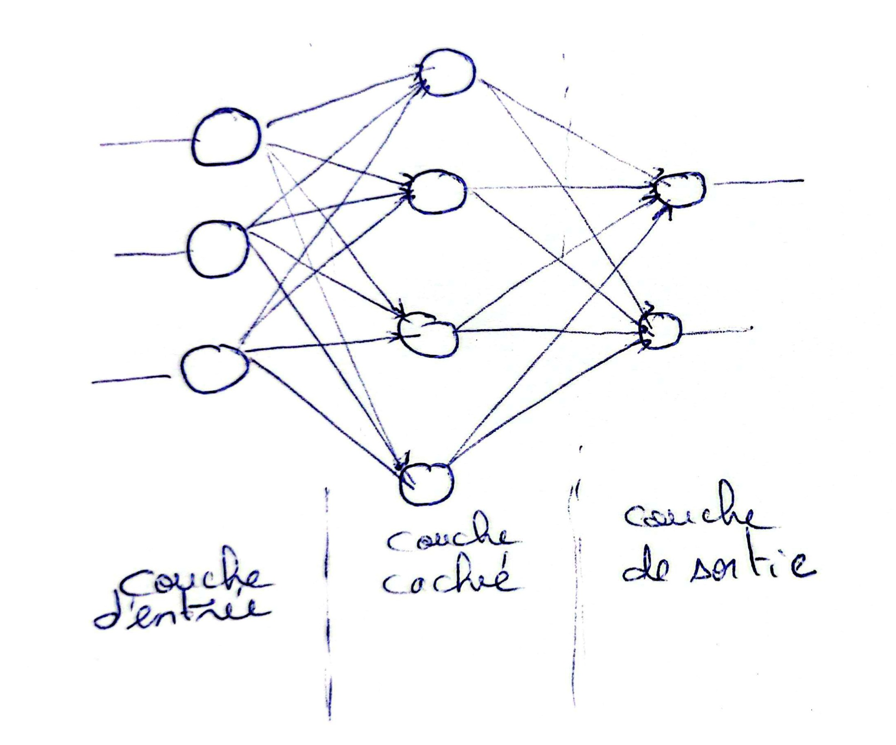

*   **Calcul des paramètres SANS les biais :**
    *   Couche 1 (Entrée -> Cachée) : $3 \text{ entrées} \times 4 \text{ neurones} = 12 \text{ poids}$
    *   Couche 2 (Cachée -> Sortie) : $4 \text{ entrées} \times 2 \text{ neurones} = 8 \text{ poids}$
    *   **Total = 20 paramètres**
*   **Calcul des paramètres AVEC les biais :**
    *   Couche 1 : $12 \text{ poids} + 4 \text{ biais}$ (un pour chaque neurone de la couche cachée) $= 16 \text{ paramètres}$
    *   Couche 2 : $8 \text{ poids} + 2 \text{ biais}$ (un pour chaque neurone de sortie) $= 10 \text{ paramètres}$
    *   **Total = 26 paramètres**

### Question 3.b : Équations et dimensions

Voici les dimensions complétées pour le *forward pass* avec un batch de taille $N$ :

*   $H$ = ReLU( $X$ · $W_1$^$T$ + $b_1$ )
*   $Y$ = $H$ · $W_2$^$T$ + $b_2$

*   $X$  : $(N, 3)$
*   $W_1$ : $(4, 3)$ ($X \times W_1^T$ donc $W_1^T$ sera de dimension $(3, 4)$)
*   $b_1$ : $(1, 4)$ -> diffusé en $(N, 4)$
*   $H$  : $(N, 4)$
*   $W_2$ : $(2, 4)$ ($H \times W_2^T$ donc $W_2^T$ sera de dimension $(4, 2)$)
*   $b_2$ : $(1, 2)$ -> diffusé en $(N, 2)$
*   $Y$  : $(N, 2)$

### Question 3.c : Graphe de calcul et Rétropropagation

Considérons la fonction $f(x, y, z) = \frac{x}{y} + z$.

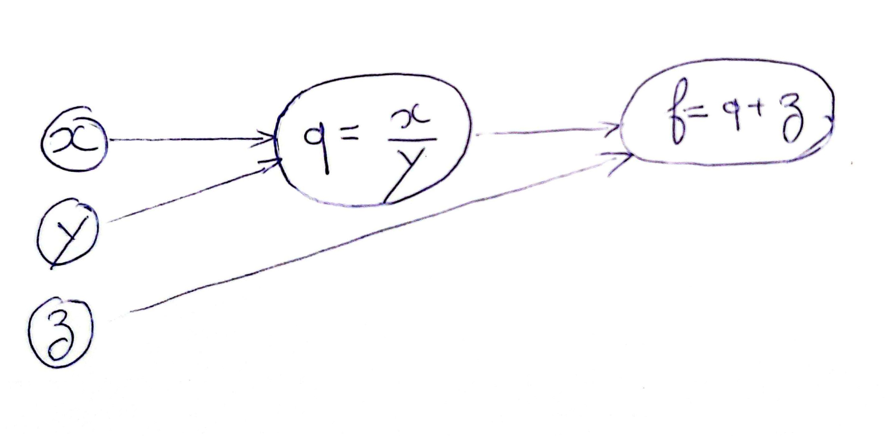

2.  **Forward pass** avec $x = 2$, $y = 4$, $z = 0$ :
    *   $q = \frac{x}{y} = \frac{2}{4} = 0.5$
    *   **Valeur de $f = q + z = 0.5 + 0 = 0.5$**

3.  **Backpropagation (Gradients locaux) :**
    *   $\frac{\partial q}{\partial x} = \frac{1}{y} = \frac{1}{4} = 0.25$
    *   $\frac{\partial q}{\partial y} = -\frac{x}{y^2} = -\frac{2}{16} = -0.125$
    *   $\frac{\partial f}{\partial z} = \mathbf{1}$

    Note: on peut aussi appliquer la règle de la chaîne :
    *   $\frac{\partial f}{\partial q} = 1$
    *   $\frac{\partial f}{\partial z} = 1$
    *   $\frac{\partial f}{\partial x} = \frac{\partial f}{\partial q} \times \frac{\partial q}{\partial x} = 1 \times 0.25 = \mathbf{0.25}$
    *   $\frac{\partial f}{\partial y} = \frac{\partial f}{\partial q} \times \frac{\partial q}{\partial y} = 1 \times (-0.125) = \mathbf{-0.125}$


### Question 3.d : Mise à jour des poids

Descente de gradient avec un learning rate $\eta = 1$. 

Formule : $param_{new} = param_{old} - \eta \times \text{gradient}$.

*   $x' = x - 1 \times 0.25 = 2 - 0.25 = \mathbf{1.75}$
*   $y' = y - 1 \times (-0.125) = 4 + 0.125 = \mathbf{4.125}$
*   $z' = z - 1 \times 1 = 0 - 1 = \mathbf{-1}$

Nouvelle valeur de $f'$ :
*   $f'(x', y', z') = \frac{1.75}{4.125} - 1 \approx 0.424 - 1 = \mathbf{-0.576}$

-> Oui, la valeur de la fonction a bien diminué (passant de $0.5$ à $-0.576$), ce qui est le comportement attendu d'une descente de gradient (oscillation entre les valeurs positives et négatives).

### Question 3.e :

*   **Règle de la chaîne (chain rule) :** Nous l'utilisons car un réseau de neurones profond est une succession de fonctions composées. La chain rule permet de calculer le gradient de l'erreur finale par rapport à n'importe quel poids du réseau en multipliant les gradients locaux couche par couche (de la sortie vers l'entrée).
*   **Mini-batchs :** Par rapport à un seul exemple (SGD), l'optimisation par mini-batchs  permet de paralléliser les calculs sur GPU et d'avoir une estimation du gradient moins bruitée (ce qui est un bon compromis). Par rapport au dataset complet (Batch Gradient Descent), elle demande moins de mémoire et permet des mises à jour des poids beaucoup plus fréquentes, accélérant ainsi la convergence.

### Question 3.f : Association (Texte à trous)

| Tâche | Fonction finale (Sortie) | Fonction de perte (Loss) |
| :--- | :--- | :--- |
| Classification binaire | 1. **Sigmoïde** | A. **BCE (Entropie Croisée Binaire)** |
| Classification multi | 2. **Softmax** | B. **Cross Entropy (Entropie Croisée)** |
| Régression pure | 3. **Identité (aucune)** | C. **MSE (Erreur Qaudratique Moyenne)** |

## Exercice 4 : Votre premier réseau de neurones

### Question 4.a : Préparation des données

* **Les arguments `batch_size` et `shuffle` dans le `DataLoader`**
  * `batch_size` définit le nombre d'exemples qui seront propagés dans le réseau en même temps avant d'effectuer une mise à jour des poids.
  * `shuffle` permet de mélanger aléatoirement l'ordre des données à chaque époque.

* **Pourquoi `shuffle` doit-il avoir une valeur différente pour l'entraînement et pour le test ?**

  On active `shuffle=True` pour l'entraînement afin d'éviter que le modèle n'apprenne par cœur l'ordre des exemples ou ne soit biaisé par une suite de données de la même classe, ce qui améliore sa généralisation. En revanche, pour le test, l'ordre n'a aucune importance sur le calcul final de la précision. On met donc `shuffle=False`.

### Question 4.b : Implémentation du réseau

1. **L'utilité de `torch.flatten(x, 1)` avant de passer les données à la couche linéaire**

   Les images ont une forme 3D (3 canaux). Et puisque une couche linéaire (`nn.Linear`) attend un vecteur 1D en entrée, on utilise `torch.flatten(x, 1)` pour aplatir l'image en un seul grand vecteur tout en préservant la dimension du batch.

2. **Pourquoi est-il crucial de ne pas ajouter la fonction d'activation Softmax à la fin de notre réseau quand on s'apprête à utiliser `nn.CrossEntropyLoss` dans PyTorch ?**

   Dans PyTorch, la fonction `nn.CrossEntropyLoss` applique déjà automatiquement un `LogSoftmax` suivi d'une perte `NLLLoss` (Negative Log Likelihood Loss). Si nous ajoutons manuellement une couche Softmax à la fin de notre réseau, la fonction l'appliquerait une seconde fois, ce qui fausserait totalement le calcul des gradients et empêcherait le modèle d'apprendre.

### Question 4.c : Entraînement du modèle

* **La différence fondamentale entre `optimizer.zero_grad()` et `loss.backward()` ?**

  * `optimizer.zero_grad()` sert à mettre à zéro les gradients accumulés lors de l'itération précédente, sinon PyTorch additionnerait les nouveaux gradients aux anciens.
  * `loss.backward()` sert à calculer les nouveaux gradients de la fonction de perte par rapport à tous les paramètres du modèle, en utilisant la rétropropagation.

### Question 4.d : Évaluation sur l'ensemble de test

1. **L'utilité du bloc `with torch.no_grad():` lors de l'évaluation et l'avantage en termes de ressources matérielles**

   Ce bloc désactive le calcul et le stockage des gradients en mémoire puisque on n'a pas besoin de mettre à jour les poids du modèle pendant l'évaluation. Cela réduit considérablement l'utilisation de la mémoire vive (RAM/VRAM) et accélère le temps de calcul.

2. **Si votre classificateur prédisait les classes de manière purement aléatoire, à quelle précision (accuracy) environ devriez-vous vous attendre sur CIFAR-10 ?**

   Le dataset CIFAR-10 contient 10 classes équilibrées. Une prédiction purement aléatoire aurait donc 1 chance sur 10 de tomber juste. On s'attendrait alors à une précision d'environ **10 %**.

### Output du script train.py

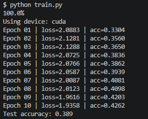
---
## Exercice 5 : Utilisation de TensorBoard

### Question 5.a : Préparation et dossier de logs

* **Pourquoi est-il important d'inclure la date, l'heure et les hyperparamètres dans le nom du dossier de logs (`run_name`) ?**

  C'est pour mieux organiser et tracer nos expériences. En incluant ces informations, chaque exécution (run) possède un identifiant unique, ce qui évite d'écraser les anciens logs par erreur et permet d'identifier rapidement à quelle configuration (modèle, learning rate, batch size) correspond chaque courbe dans l'interface TensorBoard, facilitant ainsi la comparaison entre les différents tests.

### Question 5.d : Visualisation TensorBoard (Smoothing et Bruit)

* **À quel niveau de smoothing distinguez-vous clairement la tendance sans masquer des changements importants ?**

  Dans l'onglet Scalars, un niveau de smoothing réglé **0.6 à 0.8** permet généralement de bien dégager la tendance globale à la baisse de la perte, tout en gardant une trace des variations / des pics anormaux.

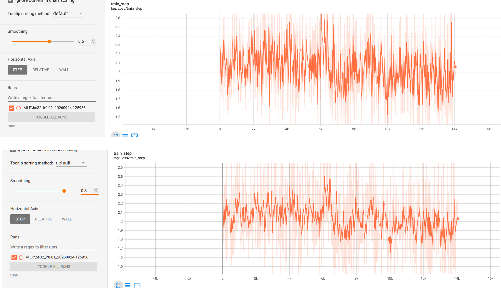

* **Pourquoi observe-t-on autant de bruit sur `Loss/train_step` comparativement à `Loss/train` ?**

  La courbe `Loss/train_step` affiche la perte calculée pour un seul mini-batch. Donc l'erreur peut beaucoup varier d'une itération à l'autre (forte variance temporelle). 
  À l'inverse, `Loss/train` est la moyenne de toutes les pertes de tous les batchs (à la fin d'une époque complète). Cette moyenne lisse naturellement les écarts, donnant une courbe beaucoup plus propre et stable.

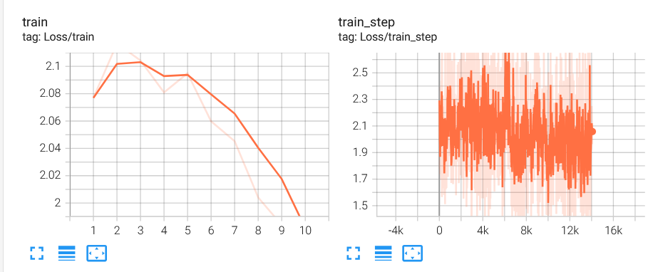

### Question 5.e : Mini-sweep d'hyperparamètres & diagnostic d'overfit

### Output de Run 1 (train_tb.py): LR = 1e-2, batch_size = 32
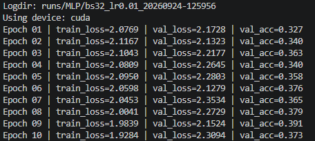

### Output de Run 2 (train_tb.py): LR = 1e-3, batch_size = 32
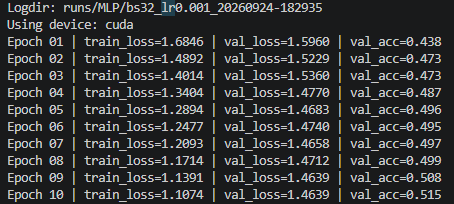

### Output de Run 3 (train_tb.py): LR = 1e-1, batch_size = 128
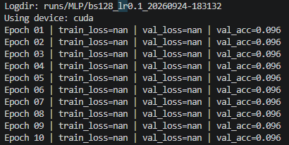

### Vue Globale de Tensorboard avec les 3 Runs
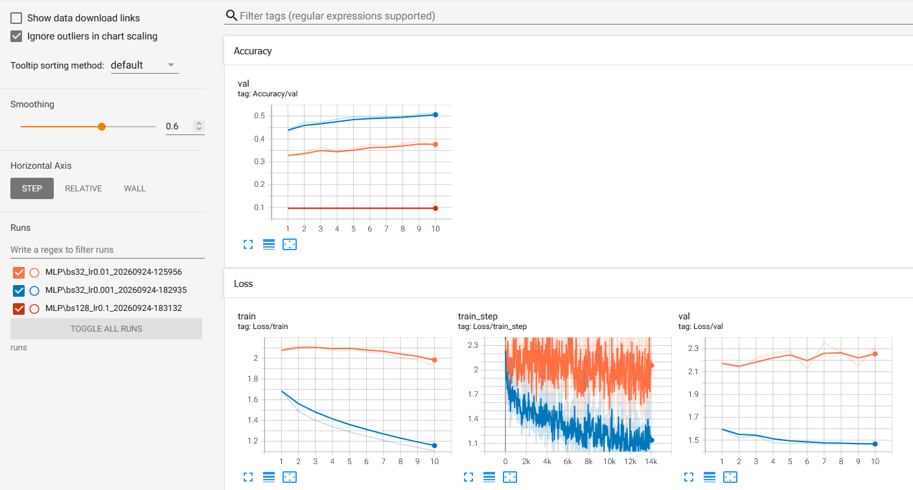

* **Analyse des 3 runs : Lequel donne la meilleure accuracy en validation ?**

    En observant les deux captures TensorBoard ci-dessous, on remarque que le **Run 2** (courbe bleue, `LR=1e-3`, `batch_size=32`) est celui qui donne les meilleurs résultats. Sa perte d'entraînement diminue de façon régulière (jusqu'à environ 1.159) et sa perte de validation descend proprement avec elle (jusqu'à environ 1.468). 

    À l'inverse :

    Le **Run 1** (courbe orange, `LR=1e-2`) a de mal à converger, sa perte reste très haute par rapport au Run 2.

    Le **Run 3** (courbe rouge et absente dans la figure, `LR=1e-1`, `batch_size=128`) a totalement divergé. Sa valeur d'après la legende est à `NaN` : on peut expliquer cela par le fait que le taux d'apprentissage était trop grand, ce qui a fait exploser les gradients.
### Courbe de Loss/train des 3 Runs
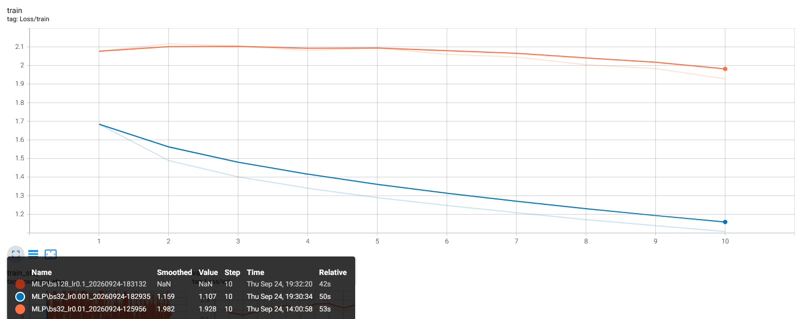

### Courbe de Loss/val des 3 Runs
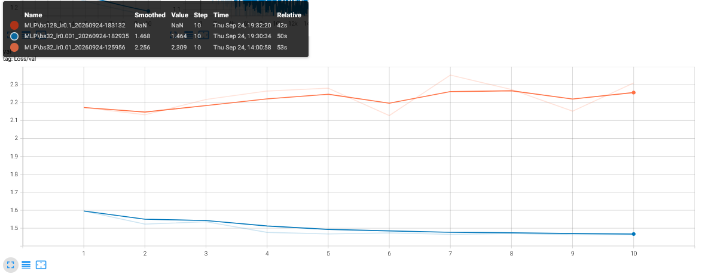

* **Comment détecte-t-on visuellement un sur-apprentissage (overfitting) sur les courbes de perte d'entraînement et de validation ?**

    L'overfitting se repère visuellement par le fait que la courbe d'entraînement (`Loss/train` dans notre cas) continue de descendre alors que la courbe de validation (`Loss/val`) stagne puis commence à remonter en oscillant (comme on le voit pour Run 1 dans la dernière courbe). Cela signifie que le modèle est en train de mémoriser le jeu d'entraînement et perd sa capacité à généraliser.
---
---
*Ce TP nous a guidés de bout en bout : accéder à des GPUs partagés avec Slurm, travailler dans un environnement Python isolé et reproductible, rappeler les fondamentaux (architecture MLP, dimensions, passes avant/arrière, mini-batch), puis implémenter un premier entraînement complet et l’instrumenter avec TensorBoard.*

*Fin*