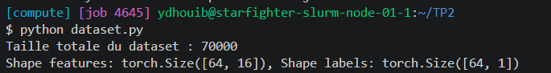
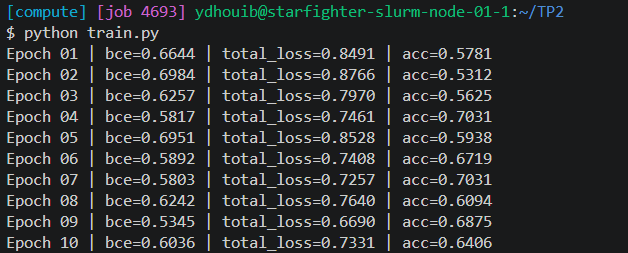
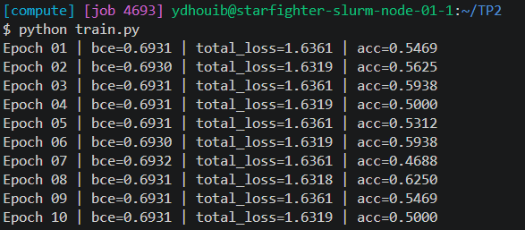
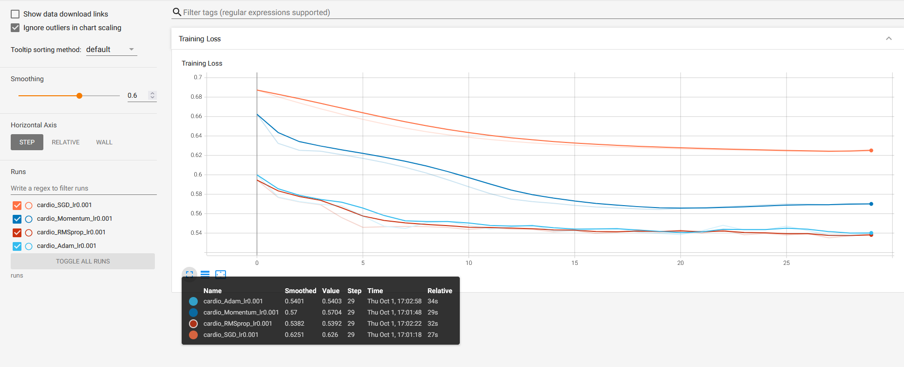
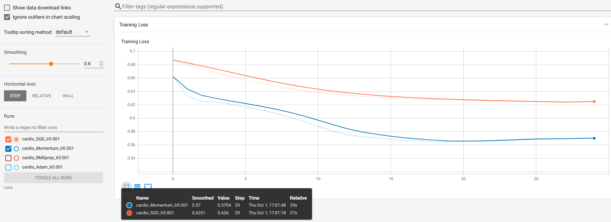
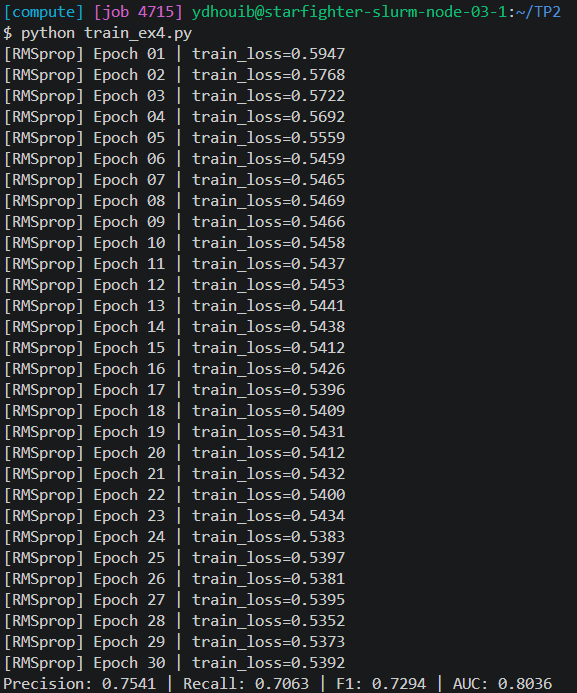

# Compte Rendu — TP2 : Régularisation, optimisation et métriques
**Cours :** CSC 8607 — Introduction au Deep Learning  
**Auteur :** Youssef DHOUIB

---

## Exercice 1 : Création d'un dataset personnalisé
 
### Output du script dataset.py

- **1- Pourquoi est-ce une mauvaise pratique d'appliquer `StandardScaler()` sur l'ensemble du dataset avant le split ?**

    Le `StandardScaler` calcule une moyenne et un écart-type pour chaque feature. Si on le fait sur tout le dataset, ces statistiques incluent aussi les exemples de validation et de test, et donc des informations du jeu de test fuient dans les données d'entraînement (*data leakage*). L'évaluation ne réflète alors la vraie performance du modèle, puisque le test n'est plus totalement "inconnu" pour lui.

    -> il faut faire le split d'abord, puis d'ajuster le scaler uniquement sur le train, et d'appliquer ensuite ce même scaler (`transform`) sur la validation et le test.
 
- **2- Quelle classe PyTorch utiliser à la place de `Dataset` pour 500 Go de données tabulaires ?**

    On utiliserait **`IterableDataset`**. Contrairement à `Dataset` (accès par index, qui suppose en pratique d'avoir les données en mémoire), un `IterableDataset` lit les données en flux (streaming), morceau par morceau (`pd.read_csv(..., chunksize=...)`). On ne charge donc jamais tout le fichier en RAM.

---

## Exercice 2 : MLP et Régularisation L1 / L2

> **Note :** La boucle train.py de l'énoncé n'affiche aucune métrique. j'ai ajouté donc, à chaque époque, l'affichage de la BCE seule, de la loss totale (BCE + pénalités) et de l'accuracy.

### Output du train.py avec les valeurs par défaut : `l1_lambda = 1e-4`, `l2_lambda = 1e-3`

-> La régularisation est assez faible pour ne pas bloquer l'apprentissage.

### Question 2.1

### Output du train.py avec `l1_lambda = 0.1`, `l2_lambda = 0`

- **Qu'observe-t-on sur l'apprentissage (loss et précision)?**

    Dès la première époque, la BCE est bloquée à 0.6931, soit $\ln 2$, et elle ne bouge pas jusqu'à la dernière époque. La loss totale reste aussi constante, autour de 1.634. L'accuracy oscille autour de 50 % : le modèle n'apprend rien et prédit au hasard.

- **Pourquoi une régularisation trop forte produit-elle cet effet ?**

    Le réseau contient 18 817 paramètres, donc au départ $\sum |w|$ vaut environ 1000. Avec $\lambda_1 = 0.1$, la pénalité vaut environ 100, soit plus de 100 fois la BCE (≈ 0.69) : l'optimiseur ne cherche plus qu'à ramener les poids vers 0. Avec des poids quasi nuls, la sortie devient constante ($\sigma(0) = 0.5$), d'où une BCE de $-\ln(0.5) = \ln 2 \approx 0.693$ et une prédiction équivalente au hasard.

    -> Ce phénomène s'appelle le ous-apprentissage (underfitting) : le modèle est trop contraint pour capturer la relation entre les features et le label.

### Question 2.2 

- **Quel argument de l'optimiseur permet d'appliquer la régularisation L2 automatiquement ?**

    L'argument **`weight_decay`** (exemple: `optim.SGD(model.parameters(), lr=0.01, weight_decay=1e-3)`). À chaque pas, l'optimiseur ajoute `weight_decay` $\times\, w$ au gradient de chaque poids.

### Question 2.3

- **Différence entre L1 et L2 sur les poids**

  **L1 ($\lambda \sum |w|$) (Lasso):** le gradient de la pénalité est constant ($\lambda \cdot \text{sign}(w)$), il pousse tous les poids vers 0 avec la même force, même quand ils sont déjà petits. Beaucoup de poids finissent donc par être nuls : on obtient un modèle parcimonieux, ce qui revient à faire une sélection des features.

  **L2 ($\lambda \sum w^2$) (Ridge) :** le gradient est proportionnel au poids ($2\lambda w$), donc la pénalité devient très faible quand le poids est petit. Les poids sont réduits et répartis de façon plus homogène qu'avec L1, et ils ne deviennent presque jamais exactement nuls.

---
## Exercice 3 : Comparaison des Optimiseurs et TensorBoard

> **Note :** Dans l'énoncé, le modèle est créé avec `input_size=12`, ce qui provoque une erreur de dimensions puisque le dataset contient **16 features** après le one-hot encoding. On a donc utilisé `input_size = batch['features'].shape[1]`. De plus, la graine est réinitialisée avant chaque run pour que les 4 optimiseurs partent de la même initialisation des poids.

### Question 3.1 : Capture d'écran de TensorBoard superposant les courbes de perte des 4 optimiseurs.

Courbes de la Training Loss des 4 optimiseurs : SGD (orange), Momentum (bleu foncé), RMSprop (rouge) et Adam (bleu clair). Le lissage TensorBoard est à 0.6.

### Question 3.2

- **Quel optimiseur converge le plus rapidement initialement ?**

    C'est **RMSprop** (courbe rouge) qui converge le plus vite : dès la première époque, sa perte est à **0.5947**, contre 0.6000 pour Adam, 0.6623 pour Momentum et 0.6873 pour SGD. Il atteint environ **0.546** dès l'époque 6. Adam (bleu clair) le suit de très près, et les deux finissent au même niveau : 0.5392 pour RMSprop et 0.5403 pour Adam à l'époque 30. Ce résultat est logique, puisqu'Adam reprend le principe de RMSprop en y ajoutant un moment.

### Question 3.3 : SGD simple vs Momentum

- **Comparez la courbe de SGD simple et Momentum.**

    On observe que la courbe de **Momentum** (bleu foncé) descend nettement plus vite que celle de **SGD** simple (orange), qui diminue très lentement. SGD termine à **0.626** après 30 époques, une valeur que Momentum atteint dès l'époque 3 (0.6252). Momentum descend ensuite jusqu'à **0.5643** à l'époque 20.

- **Quel est l'effet de l'ajout du moment sur la descente de gradient ?**

    Le moment accumule une vitesse à partir des gradients précédents ($v_t = \beta v_{t-1} + g_t$, avec $\beta = 0.9$). Quand les gradients vont dans la même direction, les pas s'additionnent et le pas effectif devient environ $\frac{1}{1-\beta} = 10$ fois plus grand. Quand ils oscillent, ils se compensent, ce qui lisse la trajectoire. Il y a aussi une légère remontée de la perte de Momentum après l'époque 20 (de 0.5643 à environ 0.570). Cela montre la contrepartie du moment : la vitesse accumulée peut faire légèrement dépasser le minimum.

    Donc le moment accélère fortement la convergence (environ 10 fois plus vite que SGD ici) et lisse la trajectoire, au prix d'un léger risque de dépassement du minimum.

---

## Exercice 4 : Analyse des métriques (Précision, Rappel, F1, AUC)

> **Note :** Les losses d'entraînement sont exactement les mêmes qu'à l'exercice 3 grâce à `torch.manual_seed(0)`, l'entraînement est reproductible.

### Output du script train_ex4.py

On obtient : **Precision = 0.7541**, **Recall = 0.7063**, **F1 = 0.7294** et **AUC = 0.8036**.

### Question 4.1 : Rappelez la définition de la précision (Precision) et du rappel (Recall).

- **Précision (Precision) :** $= \frac{TP}{TP + FP}$ -> permet de déteminer, parmi les patients que le modèle prédit malades, la proportion qui l'est réellement.
- **Rappel (Recall) :** $= \frac{TP}{TP + FN}$ -> permet de déterminer, parmi les patients réellement malades, la proportion que le modèle détecte.

Avec $TP$ les vrais positifs, $FP$ les faux positifs et $FN$ les faux négatifs.

### Question 4.2

- **Dans le contexte médical (détecter une maladie cardiovasculaire), vaut-il mieux privilégier un modèle avec une forte Précision ou un modèle avec un fort Rappel ?**

    Il vaut mieux privilégier un fort Rappel car un faux négatif (patient malade déclaré sain) est beaucoup plus grave : il ne sera ni suivi ni traité. Un faux positif entraîne seulement des examens complémentaires qui confirmeront après qu'il n'est pas malade.
    
    On garde tout de même un œil sur la précision (via le F1) pour ne pas alerter presque tout le monde.

### Question 4.3

- **À quoi sert l'AUC par rapport aux métriques calculées à un seuil fixe de 0.5 ?**

    Les métriques Précision, Rappel et F1 dépendent du seuil choisi (0.5) : en le changeant, on déplace le compromis entre les deux. Cependant, l'AUC mesure la qualité du modèle indépendamment du seuil, en résumant la courbe ROC (taux de vrais positifs en fonction du taux de faux positifs pour tous les seuils possibles). Elle correspond à la probabilité qu'un patient malade tiré au hasard reçoive un score plus élevé qu'un patient sain : 0.5 correspond au hasard et 1 à un classement parfait.

    Dans notre cas,  l'AUC vaut 0.8036 : cad dans environ 80 % des cas, le modèle donne un score plus élevé au patient malade qu'au patient sain. Le modèle classe donc plutôt bien les patients. En résumé, AUC permet de comparer des modèles entre eux, puis de choisir ensuite le seuil adapté au contexte.

---

*Ce TP nous a permis de manipuler des données tabulaires "réelles", de comprendre l'impact crucial de la régularisation pour éviter le surapprentissage, et d'observer comment les optimiseurs modernes accélèrent la convergence*

*Fin*